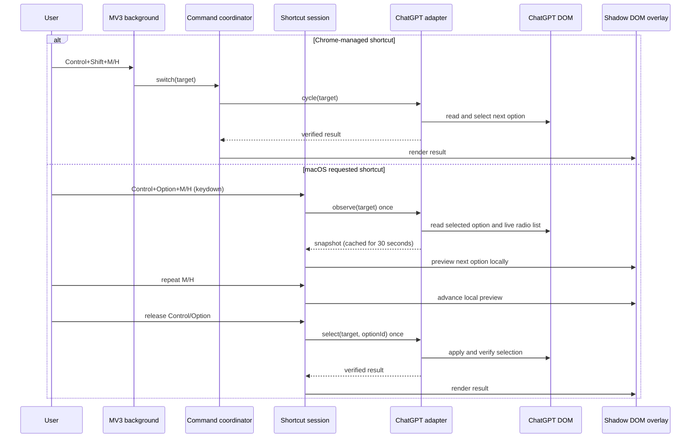

# Architecture

## Goals

- Use Chrome-managed, user-remappable commands plus the requested macOS in-page shortcut.
- Read the current selection and available options from the live website.
- Keep rapid shortcut presses deterministic.
- Isolate extension UI and styling from host pages.
- Add future websites without branching the application layer on DOM details.

## Runtime flow

## Boundaries

### Domain

`src/domain/` defines switch targets, snapshots, results, option cycling, and
typed extension messages. It has no DOM or browser dependencies.

### Website adapters

`SiteAdapter` is the only application-facing website contract:

- `observe(target)` returns the current value and complete live option list.
- `cycle(target)` selects the next enabled option.
- `select(target, optionId)` supports direct selection from the overlay.

`ChatGptAdapter` owns all knowledge of ChatGPT controls. It finds the composer
state pill, opens the advanced menu, reads `menuitemradio` state, clicks a target,
and verifies the trailing current-value label. Localization-sensitive text is
limited to the advanced-view toggle; model and reasoning selectors use stable
menu structure and radio semantics.

Additional sites should implement `SiteAdapter` and register once in
`src/adapters/registry.ts`. The background, coordinator, and overlay remain
unchanged.

### Application layer

`ShortcutSessionCoordinator` owns the macOS press lifecycle. It observes once,
cycles a local preview while the modifiers remain held, and performs exactly one
website mutation when either modifier is released. A 30-second in-memory cache
makes the next session immediate without treating a stale list as permanent.

`SwitchCoordinator` serializes Chrome-managed commands and popup requests through
one promise queue. Those APIs do not expose modifier key-up events, so they retain
single-command, immediate-apply semantics.

### Presentation

The page overlay runs inside a WXT Shadow Root with isolated events. The popup
uses the same adapter through a content-script message to show live current
values and option counts. Chrome remains the source of truth for shortcut
assignments.

Chrome rejects Control+Option (`Ctrl+Alt`) command declarations, including the
macOS spellings `MacCtrl+Option`, to avoid AltGr conflicts. The content script
therefore owns the requested Control+Option default on ChatGPT, while the
manifest exposes valid Control+Shift fallbacks that users can remap in Chrome.

## Failure behavior

- Unsupported pages or missing controls do not run broad DOM clicks.
- The background shows a short error badge when no content script responds.
- The overlay reports an actionable adapter error and closes automatically.
- Escape, backdrop clicks, window blur, and hidden-page transitions cancel active
  shortcut sessions; late async observations are ignored.
- The extension does not call private ChatGPT APIs or inspect conversation text.

## Compatibility strategy

The adapter prefers accessibility state (`role`, `aria-expanded`,
`aria-checked`) and behavior-specific attributes over generated CSS class names.
One class-name check is retained as the highest-confidence way to distinguish the
composer pill; an unlabeled composer-menu fallback covers class churn. DOM
fixtures protect the state-machine contract, while a real Chrome smoke test is
required before release because ChatGPT's UI is not versioned for extensions.
